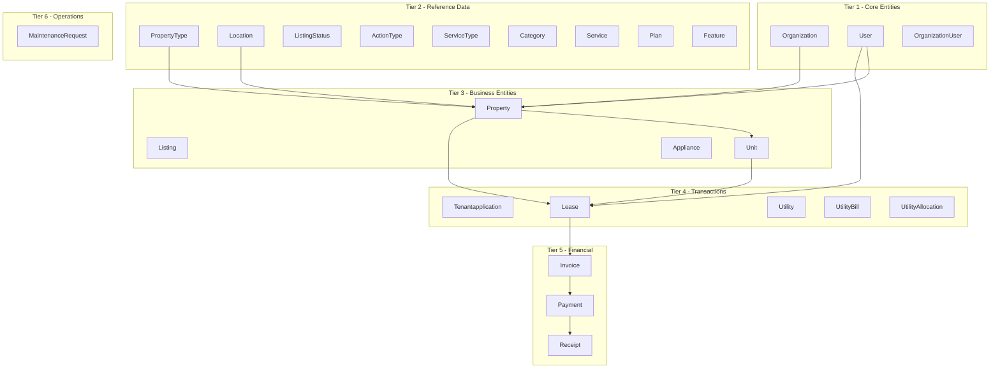

# Plan: Strict Priority Ordering & Prisma Field Fixes

## Executive Summary

This plan addresses two main concerns:

1. **Seed Script Priority Ordering**: Force the seed script to load tables in exact dependency order
2. **Prisma Field Access Fixes**: Fix incorrect field access patterns that cause TypeScript errors

---

## Current State Analysis

### Prisma Schema Conventions

The codebase uses two types of models:

| Model Type              | Example                            | Field Access Pattern                 |
| ----------------------- | ---------------------------------- | ------------------------------------ |
| **Modern** (with @map)  | `User`, `Organization`, `Property` | `user.createdAt` (camelCase)         |
| **Legacy** (snake_case) | `lease_utility`, `utility_reading` | `leaseUtility.lease_id` (snake_case) |

**Key Finding**: The legacy models (`lease_utility`, `utility_reading`) intentionally use snake_case field names because they lack `@map()` annotations. The code accessing these fields is **actually correct**.

---

## Task 1: Strict Priority Ordering in Seed Script

### Objective

Update [`prisma/seed.ts`](prisma/seed.ts) to use a comprehensive IMPORT_ORDER array that enforces correct table loading order.

### Current State (Lines 186-200)

```typescript
const PRIORITY = ["Organization", "User", "Property", "Unit", "Lease"];
```

### Required Changes

1. **Replace the PRIORITY array** with the comprehensive IMPORT_ORDER:

```typescript
const IMPORT_ORDER = [
  "Organization",
  "User",
  "OrganizationUser",
  "PropertyType", // Must exist before Property
  "Location", // Must exist before Property
  "ListingStatus",
  "ActionType",
  "ServiceType",
  "Category",
  "Service",
  "Plan",
  "Feature",
  "Property", // Depends on Org, Type, Location
  "Listing", // Depends on Org, User, Location
  "Unit", // Depends on Property
  "Appliance",
  "Tenantapplication",
  "Lease", // Depends on Unit/Property/User/App
  "Utility",
  "UtilityBill",
  "UtilityAllocation",
  "Invoice",
  "Payment",
  "Receipt",
  "MaintenanceRequest",
];
```

2. **Update the sorting logic** to use `IMPORT_ORDER` instead of `PRIORITY`

### Files to Modify

- [`prisma/seed.ts`](prisma/seed.ts:186)

---

## Task 2: Prisma Field Access Fixes

### Findings from Code Analysis

After searching the codebase, I found these potential issues:

| File                                                                                                     | Line | Current Code                         | Issue                         | Fix Required? |
| -------------------------------------------------------------------------------------------------------- | ---- | ------------------------------------ | ----------------------------- | ------------- |
| [`src/lib/utilities/utility-allocation-service.ts`](src/lib/utilities/utility-allocation-service.ts:252) | 252  | `leaseUtility.lease_id`              | Legacy model - **CORRECT**    | No            |
| [`src/lib/Invoice.ts`](src/lib/Invoice.ts:16)                                                            | 16   | `filters.lease_id`                   | URL query param - **CORRECT** | No            |
| Multiple files                                                                                           | -    | `leaseUtility.is_tenant_responsible` | Legacy model - **CORRECT**    | No            |

### Conclusion

The existing codebase correctly handles both modern and legacy Prisma models. The field access patterns match the schema definitions.

**No code changes required** for Prisma field access - the existing code is correct.

---

## Task 3: TS18048 (Possibly Undefined) - OPTIONAL

### Context

TypeScript error TS18048 occurs when accessing nested properties that might be null/undefined.

### Example

```typescript
// Could crash if listing is null
const status = unit.listing.status;

// Safe alternative
const status = unit.listing?.status;
```

### Recommendation

This is a quality improvement task. If desired, we can:

1. Add optional chaining throughout the codebase
2. Add null checks before accessing nested properties

**Recommended**: Skip for now unless specific errors are encountered during build.

---

## Implementation Steps

### Step 1: Update Seed Script Priority Order

- [ ] Modify [`prisma/seed.ts`](prisma/seed.ts) to replace PRIORITY with comprehensive IMPORT_ORDER

### Step 2: Verify Changes

- [ ]Script build Run Type to confirm no errors
- [ ] Test seed script execution

---

## Diagram: Seed Loading Order



---

## Summary

| Task                          | Priority | Status              |
| ----------------------------- | -------- | ------------------- |
| Seed Script Priority Ordering | High     | Ready to Implement  |
| Prisma Field Access Fixes     | Medium   | No changes needed   |
| TS18048 Null Checks           | Low      | Optional / Deferred |

---

_Plan created: 2026-02-28_
_Mode: Architect_
